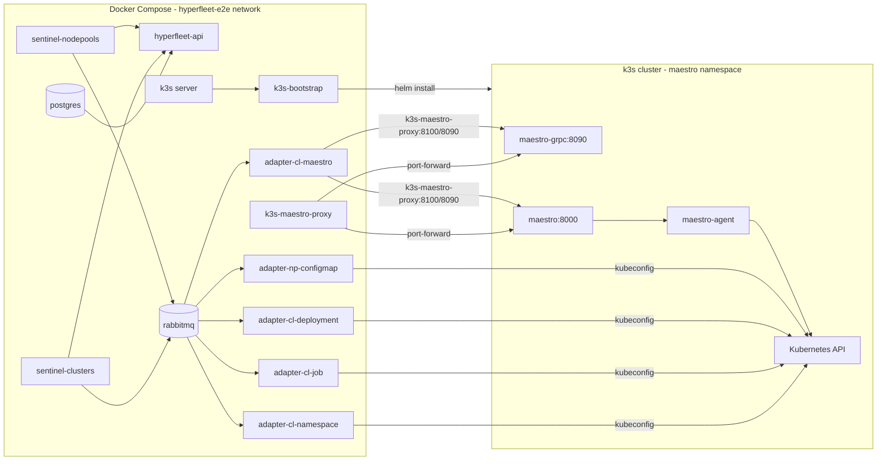

# HyperFleet Docker Compose E2E Setup Report

Date: 2026-06-05  
Environment: macOS, Podman

## Goal

Run the HyperFleet control plane locally via Docker Compose (RabbitMQ broker) with a **self-contained k3s cluster** hosting Maestro server + agent. Adapters reconcile Kubernetes and Maestro resources on that cluster. Then execute the **tier0** E2E suite from `hyperfleet-e2e`.

An optional **GKE mode** (`TRANSPORT_TARGET=gke`) remains available for external cluster testing.

## Architecture



## Repository Layout

```
docker-compose-e2e/
├── docker-compose.yml          # Full stack definition
├── .env                        # Ports, paths, namespace, Maestro/GKE settings
├── configs/
│   ├── api/config.yaml
│   ├── broker/sentinel-broker.yaml
│   ├── sentinel/{clusters,nodepools}-config.yaml
│   ├── adapters/               # Generated from hyperfleet-e2e testdata
│   └── kube/config             # Generated token-based kubeconfig
├── scripts/
│   ├── setup.sh                # One-shot bring-up
│   ├── teardown.sh
│   ├── prepare-adapter-configs.sh
│   ├── prepare-kubeconfig.sh
│   └── run-tier0.sh
└── output/                     # Test logs and JUnit XML
```

Component source repos (sibling directories):

| Component | Path |
|-----------|------|
| API | `../hyperfleet-api` |
| Sentinel | `../hyperfleet-sentinel` |
| Adapter | `../hyperfleet-adapter` |
| E2E tests + adapter YAML | `/Users/amarin/work/workspaces/github/hyperfleet/hyperfleet-e2e/ue2e/main` |

## Successful Setup Steps

### 1. Prerequisites verified

- `podman`, `podman compose` (via external `docker-compose` provider)
- `kubectl` with context `gke_hcm-hyperfleet_europe-southwest1-a_hyperfleet-dev-amarin-eu1`
- Maestro running in namespace `maestro` with consumer `cluster1` registered
- E2E repo at `hyperfleet-e2e/ue2e/main` with `make build` producing `bin/hyperfleet-e2e`

### 2. Built local images

```bash
cd docker-compose-e2e
podman build -t hyperfleet-api:local ../hyperfleet-api
podman build -t hyperfleet-sentinel:local ../hyperfleet-sentinel
podman build -t hyperfleet-adapter:local ../hyperfleet-adapter
```

Dockerfiles run `make build` (which includes OpenAPI generation for API/sentinel).

### 3. Prepared adapter configs from E2E testdata

Tier0 adapters copied from `testdata/adapter-configs/` and patched for compose:

| Adapter | Resource type | RabbitMQ topic | Queue |
|---------|---------------|----------------|-------|
| cl-namespace | clusters | `hyperfleet-e2e-compose-clusters` | `hyperfleet-e2e-compose-clusters-cl-namespace` |
| cl-job | clusters | same | `...-cl-job` |
| cl-deployment | clusters | same | `...-cl-deployment` |
| cl-maestro | clusters | same | `...-cl-maestro` |
| np-configmap | nodepools | `hyperfleet-e2e-compose-nodepools` | `hyperfleet-e2e-compose-nodepools-np-configmap` |

```bash
./scripts/prepare-adapter-configs.sh
```

### 4. Maestro port-forward (host → GKE)

Adapters in Linux containers cannot reach in-cluster `maestro.maestro.svc` DNS. Port-forwards expose Maestro on the host; adapters use `host.containers.internal` (Podman on macOS).

```bash
kubectl port-forward -n maestro svc/maestro 8100:8000 &
kubectl port-forward -n maestro svc/maestro-grpc 8090:8090 &
```

`cl-maestro` adapter config is patched to:

- `http_server_address: http://host.containers.internal:8100`
- `grpc_server_address: host.containers.internal:8090`

### 5. Kubernetes credentials for containerized adapters

**Issue encountered:** Mounting `~/.kube/config` failed because:

1. `gke-gcloud-auth-plugin` is a macOS binary — not executable inside Linux containers
2. `default:default` token lacked RBAC to list cluster-scoped namespaces

**Solution:** Generate a token-based kubeconfig using the existing Helm adapter service account:

```bash
./scripts/prepare-kubeconfig.sh
# Uses SA: hyperfleet-e2e-gke1/adapter-clusters-cl-namespace
# Writes: configs/kube/config
```

Recreate adapters after kubeconfig refresh:

```bash
podman compose --env-file .env up -d --force-recreate \
  adapter-cl-namespace adapter-cl-job adapter-cl-deployment adapter-np-configmap
```

### 6. Started the stack

```bash
./scripts/setup.sh
# Or manually:
./scripts/prepare-adapter-configs.sh
./scripts/prepare-kubeconfig.sh
podman compose --env-file .env up -d
```

### 7. Port mapping notes

| Service | Host port | Reason |
|---------|-----------|--------|
| hyperfleet-api | **18000** | Port 8000 was occupied by an existing `hf kube port-forward` |
| API health | 18080 | |
| API metrics | 19090 | |
| RabbitMQ | 5672, 15672 | |
| sentinel-clusters health | 8081 | |
| sentinel-nodepools health | 8082 | |
| Maestro HTTP (port-forward) | 8100 | For E2E tests and cl-maestro adapter |

Postgres is **not** published to the host (internal compose network only).

### 8. Ran tier0 tests

```bash
./scripts/run-tier0.sh
```

Environment used by tests:

```bash
HYPERFLEET_API_URL=http://localhost:18000
MAESTRO_URL=http://localhost:8100
NAMESPACE=hyperfleet-e2e-compose
TESTDATA_DIR=<e2e-repo>/testdata
```

Tests must run from the E2E repo directory (not `docker-compose-e2e/`) so payloads and config resolve correctly.

## Tier0 Test Results

### k3s transport (default) — 2026-06-05

**Duration:** 73 seconds wall time (14 tests in parallel)  
**Result:** **14 Passed | 0 Failed**

Artifacts: `output/tier0-20260605T110513Z/`

### GKE transport (legacy) — 2026-06-05

**Duration:** 752.8 seconds (~12.5 minutes)  
**Result:** **14 Passed | 0 Failed | 45 Skipped**

Artifacts: `output/tier0-20260605T064650Z.log`

### Tests executed (tier0 label)

| Suite | Test |
|-------|------|
| cluster | Complete workflow creation → Reconciled |
| cluster | K8s resources with correct templated values |
| cluster | cl-deployment dependency on cl-job |
| cluster | PATCH update reconciliation |
| cluster | Full deletion lifecycle |
| cluster | 409 Conflict on PATCH of soft-deleted cluster |
| cluster | Cascade delete to nodepools |
| nodepool | Complete workflow creation → Reconciled |
| nodepool | K8s resources for all required adapters |
| nodepool | PATCH update reconciliation |
| nodepool | Full deletion lifecycle |
| nodepool | 409 Conflict on PATCH of soft-deleted nodepool |
| adapter/maestro | ManifestWork happy path |
| adapter/maestro | Generation idempotency (skip unchanged) |

## Issues Resolved During Setup

| # | Issue | Resolution |
|---|-------|------------|
| 1 | `docker compose` wrapper calls missing `podman-compose` | Use `podman compose` explicitly in scripts |
| 2 | `host.docker.internal:host-gateway` fails on Podman | Use `host.containers.internal`; remove `extra_hosts` |
| 3 | Port 8000/5432 conflicts | API on 18000; postgres not host-published |
| 4 | E2E tests couldn't find `testdata/` | Run from E2E repo; set `TESTDATA_DIR` |
| 5 | K8s adapters: `gke-gcloud-auth-plugin not found` | Token-based kubeconfig via `prepare-kubeconfig.sh` |
| 6 | K8s RBAC: `default:default` cannot list namespaces | Token from `hyperfleet-e2e-gke1/adapter-clusters-cl-namespace` SA |
| 7 | k3s healthcheck `k3s kubectl` fails | Use `kubectl get nodes` (entrypoint is `/bin/k3s`) |
| 8 | Podman creates directories for missing file bind-mounts | Mount `./configs/kube/` directory; `rm -rf` stale paths in setup |
| 9 | Maestro PVC provisioning on stale k3s nodes | Reset `k3s-data` volume; disable Postgres persistence for E2E |
| 10 | E2E tests hit GKE via default `~/.kube/config` | Export `configs/kube/config-host` (localhost:16443) in `run-tier0.sh` |
| 11 | Stale `hf kube port-forward` on :8100 | Stop host port-forward; k3s-maestro-proxy owns the port |

## Teardown

```bash
./scripts/teardown.sh
# Stops compose stack and Maestro port-forward PIDs in .runtime/
```

## Quick Reference (repeatable workflow)

```bash
cd docker-compose-e2e

# First time or after code changes
podman build -t hyperfleet-api:local ../hyperfleet-api
podman build -t hyperfleet-sentinel:local ../hyperfleet-sentinel
podman build -t hyperfleet-adapter:local ../hyperfleet-adapter

# Bring up everything
./scripts/setup.sh

# Run release-gate tests
./scripts/run-tier0.sh

# Tear down
./scripts/teardown.sh
```

## Future Improvements

1. **Automate kubeconfig refresh** — tokens expire (default 24h); add cron or compose init container
2. **Configurable API host port** — document conflict detection or auto-select free port
3. **Helm parity option** — optional path using `deploy-clm.sh` on GKE vs compose for local CLM
4. **Linux gke-gcloud-auth-plugin in adapter image** — alternative to token kubeconfig for long-lived setups
5. **Add `configs/kube/config` to `.gitignore`** — contains short-lived credentials
